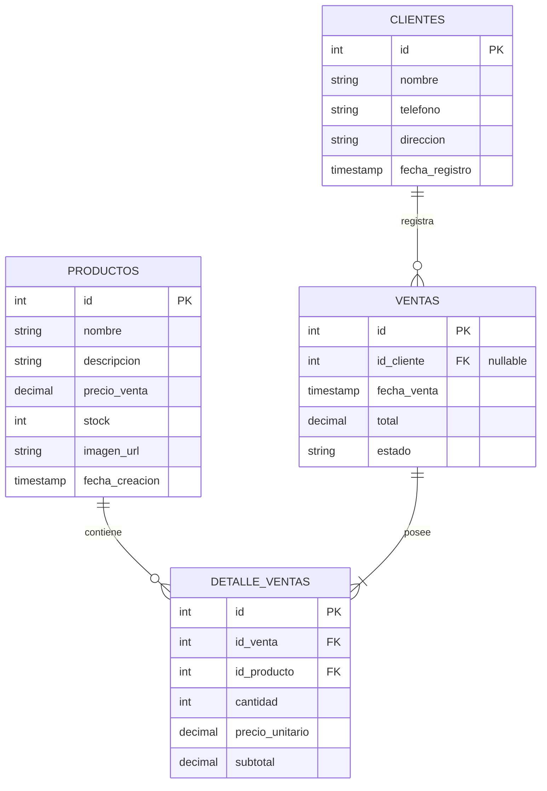

# 📖 Documentación Técnica: EmprendeControl

Este documento describe la arquitectura de software, el diseño de la base de datos, las especificaciones de la API REST y la configuración técnica del proyecto **EmprendeControl**.

---

## 1. Arquitectura de Software

La aplicación utiliza un modelo **Cliente-Servidor** desacoplado, lo que permite separar la interfaz de usuario de la lógica del negocio y el almacenamiento de datos.

### 📐 Diagrama de Arquitectura Conceptual

```mermaid
graph TD
    subgraph Cliente (Frontend)
        A[App Móvil / Web - React.js] -->|Capacitor wrapper| B[Dispositivo Android / iOS]
        A -->|Estilos Flexbox/Grid| C[Diseño Responsive]
    end

    subgraph Servidor (Backend)
        D[API REST - Node.js + Express]
        E[CORS Middleware] --> D
        F[MySQL Driver - mysql2] --> D
    end

    subgraph Base de Datos
        G[(MySQL Local - XAMPP)]
    end

    A -->|Peticiones HTTP JSON| D
    D -->|Respuestas JSON| A
    D -->|Consultas SQL| G
    G -->|Resultados de Datos| D
```

### 📱 Frontend (Cliente)
* **SPA con React.js:** Se encarga de renderizar la interfaz y manejar el estado global.
* **Capacitor:** Envuelve la webapp de React para generar contenedores nativos móviles. Facilita la comunicación con las APIs nativas del dispositivo en caso de requerirse en un futuro (como almacenamiento local nativo o cámara para escanear códigos de barra).
* **Responsive Design:** Utiliza CSS puro (Flexbox, CSS Grid y Media Queries) para adaptarse perfectamente a pantallas móviles de diferentes resoluciones y a vistas de navegador de escritorio.

### 💻 Backend (Servidor)
* **Node.js + Express.js:** Expone una API REST para procesar las peticiones del frontend.
* **mysql2 / Sequelize (opcional):** Conector para interactuar con la base de datos MySQL local.
* **Middlewares:**
  * `cors`: Permite solicitudes desde dominios cruzados (necesario para conectar la app móvil Capacitor con el backend).
  * `express.json()`: Para el parseo de payloads JSON entrantes.

---

## 2. Diseño de la Base de Datos MySQL

La base de datos `db_emprendecontrol` está diseñada bajo el modelo relacional para mantener la integridad de los datos de ventas, inventario y clientes.

### 🗺️ Diagrama Entidad-Relación (Relacional)



### 💾 Script de Creación de Tablas (DDL)

```sql
CREATE DATABASE IF NOT EXISTS db_emprendecontrol CHARACTER SET utf8mb4 COLLATE utf8mb4_unicode_ci;
USE db_emprendecontrol;

-- Tabla: Clientes
CREATE TABLE clientes (
    id INT AUTO_INCREMENT PRIMARY KEY,
    nombre VARCHAR(100) NOT NULL,
    telefono VARCHAR(20) NULL,
    direccion VARCHAR(255) NULL,
    fecha_registro TIMESTAMP DEFAULT CURRENT_TIMESTAMP
) ENGINE=InnoDB;

-- Tabla: Productos (Inventario)
CREATE TABLE productos (
    id INT AUTO_INCREMENT PRIMARY KEY,
    nombre VARCHAR(150) NOT NULL,
    descripcion TEXT NULL,
    precio_venta DECIMAL(10, 2) NOT NULL,
    stock INT NOT NULL DEFAULT 0,
    imagen_url VARCHAR(255) NULL,
    fecha_creacion TIMESTAMP DEFAULT CURRENT_TIMESTAMP
) ENGINE=InnoDB;

-- Tabla: Ventas
CREATE TABLE ventas (
    id INT AUTO_INCREMENT PRIMARY KEY,
    id_cliente INT NULL,
    fecha_venta TIMESTAMP DEFAULT CURRENT_TIMESTAMP,
    total DECIMAL(10, 2) NOT NULL DEFAULT 0.00,
    estado VARCHAR(20) DEFAULT 'completada', -- 'completada', 'cancelada'
    FOREIGN KEY (id_cliente) REFERENCES clientes(id) ON DELETE SET NULL
) ENGINE=InnoDB;

-- Tabla: Detalle de Ventas
CREATE TABLE detalle_ventas (
    id INT AUTO_INCREMENT PRIMARY KEY,
    id_venta INT NOT NULL,
    id_producto INT NOT NULL,
    cantidad INT NOT NULL,
    precio_unitario DECIMAL(10, 2) NOT NULL,
    subtotal DECIMAL(10, 2) GENERATED ALWAYS AS (cantidad * precio_unitario) STORED,
    FOREIGN KEY (id_venta) REFERENCES ventas(id) ON DELETE CASCADE,
    FOREIGN KEY (id_producto) REFERENCES productos(id) ON DELETE RESTRICT
) ENGINE=InnoDB;
```

---

## 3. Especificación de la API REST

Todos los endpoints del backend retornan y aceptan datos en formato **JSON**.

### 📦 Módulo de Inventario (`/api/productos`)
* **`GET /api/productos`**: Retorna el listado completo de productos.
* **`GET /api/productos/:id`**: Retorna el detalle de un producto específico.
* **`POST /api/productos`**: Registra un nuevo producto.
  * *Payload:* `{ "nombre": "Camiseta", "descripcion": "Talla M", "precio_venta": 15.00, "stock": 50, "imagen_url": "" }`
* **`PUT /api/productos/:id`**: Actualiza los datos de un producto.
* **`DELETE /api/productos/:id`**: Elimina un producto de la base de datos.

### 👥 Módulo de Clientes (`/api/clientes`)
* **`GET /api/clientes`**: Retorna todos los clientes registrados.
* **`GET /api/clientes/:id`**: Retorna el detalle de un cliente.
* **`POST /api/clientes`**: Registra un nuevo cliente.
  * *Payload:* `{ "nombre": "Juan Pérez", "telefono": "0999999999", "direccion": "Av. Principal 123" }`
* **`PUT /api/clientes/:id`**: Actualiza la información de un cliente.
* **`DELETE /api/clientes/:id`**: Elimina un cliente.

### 🛒 Módulo de Ventas (`/api/ventas`)
* **`GET /api/ventas`**: Lista el historial de ventas del negocio.
* **`POST /api/ventas`**: Registra una nueva venta, actualizando automáticamente el stock del producto vendido e ingresando su detalle.
  * *Payload:*
    ```json
    {
      "id_cliente": 1,
      "total": 30.00,
      "detalles": [
        {
          "id_producto": 3,
          "cantidad": 2,
          "precio_unitario": 15.00
        }
      ]
    }
    ```

### 📊 Módulo de Reportes (`/api/reportes`)
* **`GET /api/reportes/ganancias`**: Retorna las ganancias calculadas en base a un periodo de tiempo.
* **`GET /api/reportes/resumen`**: Retorna estadísticas básicas (Total de productos en stock, número de clientes, número de ventas del día).

---

## 4. Configuración Especial para Capacitor

Cuando se compila una app React con Capacitor y se ejecuta en un emulador o dispositivo real:
1. `localhost` o `127.0.0.1` apunta al propio dispositivo móvil, no a la computadora local donde corre el servidor Node.js/Express.
2. **Solución:**
   - Obtener la IP local de tu computador (ej. `192.168.100.15`).
   - Configurar la API URL del frontend usando esta IP local:
     ```javascript
     // src/config.js o similar
     export const API_URL = 'http://192.168.100.15:5000/api';
     ```
   - Habilitar CORS en el backend para permitir conexiones externas dentro de la misma red WiFi:
     ```javascript
     const express = require('express');
     const cors = require('cors');
     const app = express();
     app.use(cors()); // Permite peticiones de cualquier origen
     ```

---

## 5. Lineamientos de UI/UX (Responsive)

Para que la interfaz sea premium, intuitiva y responsive, se seguirán estas pautas:
* **Paleta de Colores:** Basada en tonos oscuros elegantes o claros modernos con colores contrastantes para destacar las acciones de ventas (`#4F46E5` Indigo, `#10B981` Emerald para ingresos/ventas, `#EF4444` Rose para stock bajo).
* **Tipografía:** Se cargará la fuente **Inter** o **Outfit** desde Google Fonts para una legibilidad óptima en pantallas pequeñas.
* **Adaptabilidad:**
  * **Móvil (< 768px):** Menú de navegación inferior estilo "TabBar", botones táctiles grandes, tablas sustituidas por listas en formato card para facilitar la lectura.
  * **Escritorio / Tablet (>= 768px):** Menú lateral "Sidebar", paneles divididos para realizar ventas de forma más ágil en dos columnas.
